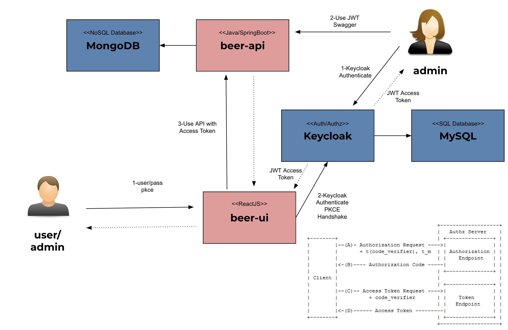
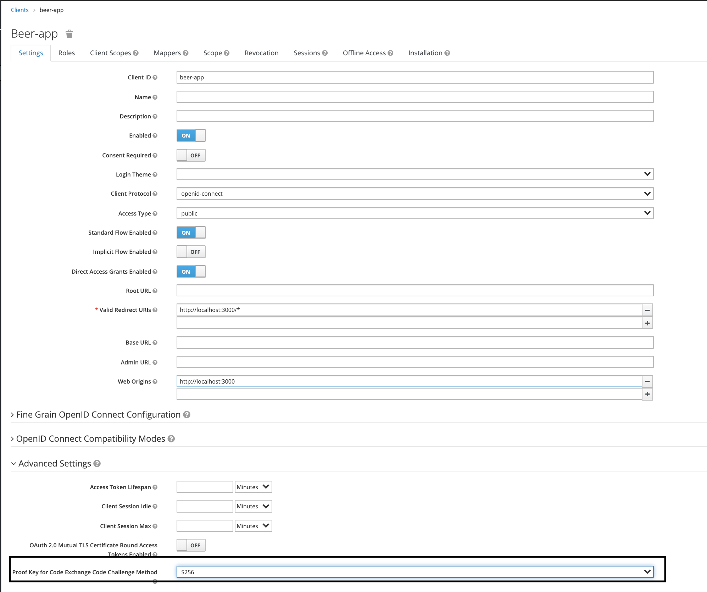
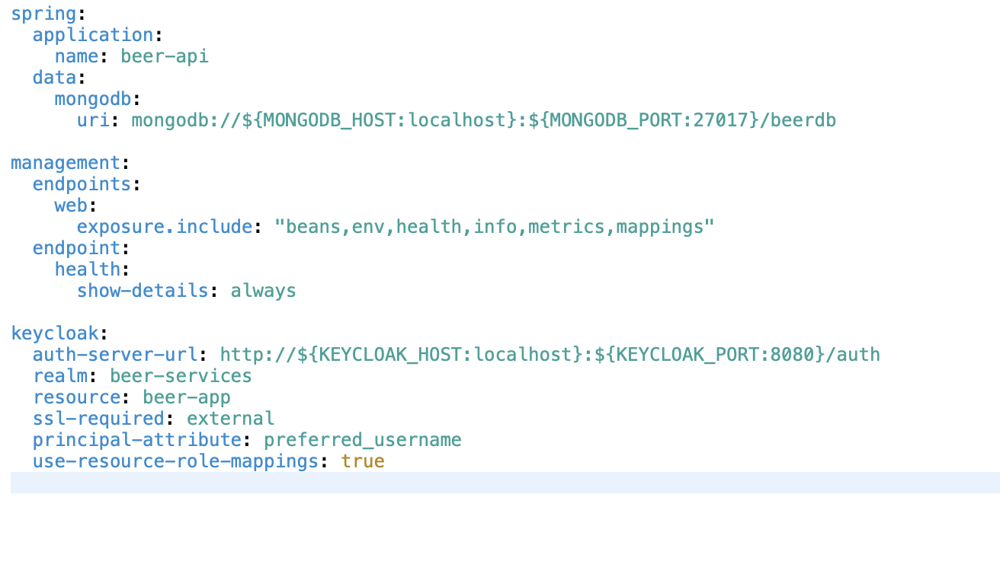
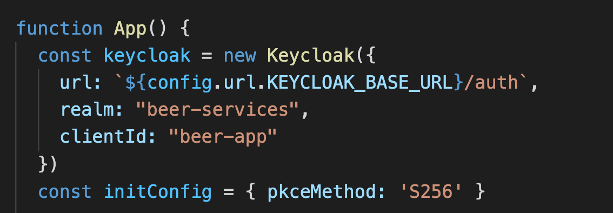

# Beer Application with PKCE Flow

Beer Application using [`Keycloak`](https://www.keycloak.org/)(with PKCE). 
PKCE is the recommended flow for SPA (clients who can't keep secrets) using OpenID Connect and OAuth 2.0 protocol.

- Before the client begins the authorization process, it generates a random value called code_verifier.
- A hash of this value is included on the first call to the authorization server. 
- This hash is called the code_challenge.
- The server will save this code_challenge.
- The process continues the same, if the validation is correct the server will return the code with which to request the token.
- When requesting the token, the client sends the code_verifier, not the hash.
- The server compares the code_verifier with the hash it has, to see if they are the same.
- If these are the same, the server can confirm that the person requesting the token is the same one that sent the code at the beginning, and not a malicious application that stole the code, so it will send the access token.

## Project diagram



## Applications

- **beer-api**

  `Spring Boot` Web Java backend application that exposes a Rest API. Its secured endpoints with Keycloak using Json Web token (JWT).
  
  `beer-api` stores beer data in a [`Mongo`](https://www.mongodb.com/) database from [`Beer API`](https://api.punkapi.com/v2/beers).


- **beer-ui**

  `ReactJS` frontend application where `users` can see and comment beers and `admins` can manage beers. In order to access the application, `user` / `admin` must login using his/her username and password. Those credentials are handled by `Keycloak`. All the requests coming from `beers-ui` to secured endpoints in `beers-api` have a access token (JWT) that is generated when `user` / `admin` logs in.

## Prerequisites

- `Docker`

- `Docker-Compose`

## PKCE

As `Keycloak` supports [`PKCE`](https://oauth.net/2/pkce/) (`Proof Key for Code Exchange`) , is an extension to the Authorization Code flow to prevent certain attacks and to be able to securely perform the OAuth exchange from public clients. It is primarily used by mobile and JavaScript apps, but the technique can be applied to any client as well.

## PKCE Configuration
- keycloak configuration

- Java Spring Boot Configuration (API)

- ReactJS Configuration (UI)



## Start environment

- Add `keycloak       127.0.0.1` in /etc/hosts

- In a terminal and inside root folder run
  ```
  docker-compose up -d
  ```

## Applications URLs

| Application | URL                                   | Credentials                  |
| ----------- | ------------------------------------- | ---------------------------- |
| beer-api    | http://localhost:9080/swagger-ui.html | [Access Token](#getting-access-token) |
| beer-ui     | http://localhost:3000                 | `admin/admin` or `user/user` |
| Keycloak    | http://localhost:8080/auth/admin/     | `admin/admin`                |


### Getting Access Token

- Open a terminal

- Run the following commands to get the access token
  ```
  ACCESS_TOKEN="$(curl -s -X POST \
    "http://localhost:8080/auth/realms/beer-services/protocol/openid-connect/token" \
    -H "Content-Type: application/x-www-form-urlencoded" \
    -d "username=admin" \
    -d "password=admin" \
    -d "grant_type=password" \
    -d "client_id=beer-app" | jq -r .access_token)"

  echo $ACCESS_TOKEN
  ```


### Calling beers-api endpoints using Swagger

- Access `beers-api` Swagger website, http://localhost:9080/swagger-ui.html

- Click on `Authorize` button. Paste the `access token` (obtained at [getting-access-token](#getting-access-token)) in the `Value` field prefixed by `Bearer`, like `Bearer <access-token>`. Then, click on `Authorize` and on `Close` to finalize.


## Shutdown

  ```
  docker-compose down -v
  ```

## Useful Commands

- **MongoDB**

  List all beers
  ```
  docker exec -it mongodb mongo
  use beersdb
  db.beers.find()
  ```
  > Type `exit` to get out of MongoDB shell
